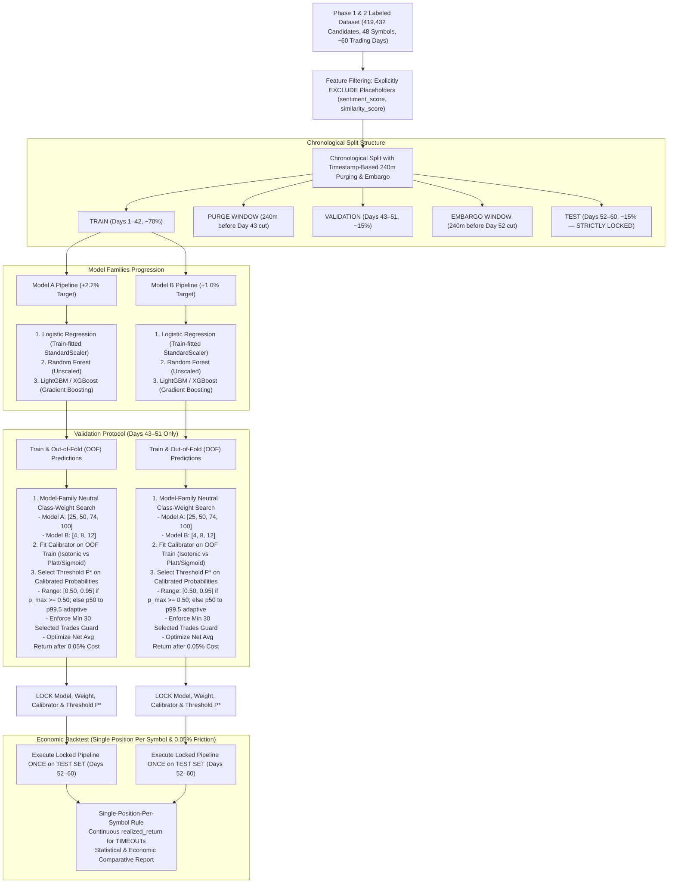

# Phase 3 — ML Model Architecture, Chronological Validation & Evaluation Protocol Plan (Final Revision)

## Executive Summary

Phase 3 executes a scientifically rigorous, zero-leakage machine learning experiment comparing two independent target formulations:
* **Model A**: Target = +2.2%, Stop = -0.9%, Horizon = 240 minutes (Phase 2 Baseline)
* **Model B**: Target = +1.0%, Stop = -0.9%, Horizon = 240 minutes (Sensitivity Candidate)

Neither model family nor target formulation is assumed to be superior beforehand. Model selection, class-weight optimization, probability calibration, and decision threshold selection occur **strictly using Training and Validation data**. The final pipeline is **LOCKED** before running a single out-of-sample evaluation on the untouched Test set.

---

## 1. Master Experiment Flowchart

---

## 2. Experimental Requirements & Protocols

### A. Data & Features
* **Features Used (9 Causal Technical Features)**: `rsi`, `obv`, `bollinger_position`, `macd`, `macd_signal`, `macd_diff`, `price_vs_vwap`, `price_vs_ema5`, `direction`.
* **Explicit Exclusion**: `sentiment_score` and `similarity_score` are excluded. No synthetic or constant fake values will be used.
* **Scaling Rules**:
  * **Logistic Regression**: `StandardScaler` fitted **strictly on Training data**. Validation and Test sets transformed using the Training-fitted scaler.
  * **Tree Models (RF & LightGBM/XGBoost)**: Unscaled raw features.

### B. Target Formulations
* **Model A**: Target = +2.2%, Stop = -0.9%, Max Hold = 240m (Baseline)
* **Model B**: Target = +1.0%, Stop = -0.9%, Max Hold = 240m (Sensitivity Candidate)
* Both target formulations consume the exact same Phase 1/Phase 2 dataset without alteration.

### C. Model Families Progression
1. **Logistic Regression** (Linear baseline)
2. **Random Forest** (Non-linear ensemble baseline)
3. **LightGBM / XGBoost** (Gradient Boosting). Prefer LightGBM if installed/compatible. If neither is available, stop and report dependency issue.

### D. Model-Family Neutral Class-Weight Search
* **Search Grids**:
  * **Model A**: `[25, 50, 74, 100]`
  * **Model B**: `[4, 8, 12]`
* **Model Abstraction**: Correctly translates positive weight $w$ for each algorithm:
  * Sklearn (LR & RF): `class_weight={0: 1.0, 1: w}`
  * Gradient Boosting (LightGBM/XGBoost): `scale_pos_weight=w`
* **Selection**: Evaluated on Validation set PR-AUC & Net Economic Return. Test set is **never** used.

### E. Chronological Split, Purging & Embargo
* **Date Boundaries**:
  * **TRAIN**: Days 1–42 (~70% of dates)
  * **VALIDATION**: Days 43–51 (~15% of dates)
  * **TEST**: Days 52–60 (~15% of dates — STRICTLY LOCKED)
* **Purging Protocol**: Any candidate candle in Training whose 240-minute outcome horizon overlaps or extends past the Day 43 boundary timestamp is **purged** from Training.
* **Embargo Protocol**: A 240-minute embargo is applied at the boundary between Validation and Test sets.

### F. Calibration Without Leakage
* **Training Phase**: Models generate Out-of-Fold (OOF) predictions on the Training set (via 5-fold chronological K-Fold on Train).
* **Fitting Calibrators**: Isotonic Regression and Platt/Sigmoid scaling calibrators are fitted on the OOF Training predictions (or Train predictions).
* **Validation Evaluation**: Candidate calibrators are evaluated on the Validation set using Expected Calibration Error (ECE) and Brier Score.
* **Locking**: The optimal calibrator is locked before touch of the Test set.

### G. Calibrated Probability Threshold Protocol & Minimum Trade-Count Guard
1. **Validation Only**: Threshold selection is performed **strictly on the Validation set (Days 43–51)**.
2. **Calibrated Probability Domain**: Thresholds are applied to **calibrated probabilities** ($P_{\text{calibrated}} = P(\text{TARGET\_HIT} \mid X)$), not raw uncalibrated model scores.
3. **Standard Range ($p_{\text{max}} \ge 0.50$)**: When the calibrated probability range supports it ($p_{\text{max}} \ge 0.50$), candidate thresholds evaluate `np.arange(0.50, 0.95, 0.02)`.
4. **Adaptive Range ($p_{\text{max}} < 0.50$)**: When calibrated probabilities remain below $0.50$ due to rare-event base rates (~1.13% for Model A, ~10.79% for Model B), candidate thresholds adapt deterministically to evaluate 23 linear steps from the Validation-set **50th percentile ($p_{50}$)** to **99.5th percentile ($p_{99.5}$)** of calibrated probabilities.
5. **Minimum 30 Selected Trades Guard**: A candidate threshold $P^*$ is eligible ONLY if it produces at least 30 selected trades on the Validation set.
6. **Objective**: Maximizes Validation Net Average Return per Selected Trade (incorporating 0.05% friction) with preference for higher trade counts when returns are comparable.
7. **Strict Locking**: The selected threshold $P^*$ is **locked prior to Test set evaluation**. Test data (Days 52–60) is **never** used to select, tune, or modify the threshold.

### H. Economic Backtesting (Single Position Per Symbol)
* **Overlap Rule**: Once a position is selected for symbol $S$ at timestamp $T$, **no second position may be opened for symbol $S$** until the active trade exits at its recorded `exit_timestamp`. Subsequent signals for symbol $S$ during the active trade are suppressed.
* **Friction**: 0.05% (5 bps) round-trip transaction cost applied to every selected trade.
* **Outcome Preservation**:
  * Classification treats `label=1` if `TARGET_HIT`, `label=0` if `STOP_HIT` or `TIMEOUT`.
  * Economic evaluation uses exact continuous `realized_return`. `TIMEOUT` trades retain their actual continuous return (not treated as -0.9% loss).

---

## 3. Required Files to Create

1. `[NEW]` [app/ml/models.py](file:///d:/proj1/proj%20files/app/ml/models.py)
   * `TradeSignalClassifier` wrapping LR, RF, LightGBM/XGBoost.
   * Train-only `StandardScaler` fitting.
   * Model-family neutral class-weight translation (`{0:1, 1:w}` vs `scale_pos_weight`).
   * Probability prediction and calibration (Isotonic / Sigmoid).

2. `[NEW]` [app/ml/evaluation.py](file:///d:/proj1/proj%20files/app/ml/evaluation.py)
   * `ChronologicalEvaluator` handling date splits (Days 1–42, 43–51, 52–60).
   * Deterministic 240m timestamp boundary purging and embargo logic.
   * Statistical metric suite (Precision, Recall, PR-AUC, ECE, Brier score, Confusion Matrix).
   * Threshold search on calibrated probabilities with adaptive percentile fallback and 30-trade minimum guard.
   * Economic backtester enforcing single-position-per-symbol rule, 0.05% friction, and realized return preservation.

3. `[NEW]` [app/ml/phase3_experiment.py](file:///d:/proj1/proj%20files/app/ml/phase3_experiment.py)
   * Complete experiment pipeline comparing Model A vs Model B across LR, RF, Boosting.
   * Model selection hierarchy (Train $\to$ Validation $\to$ Lock $\to$ Test).
   * Generates `data/processed/phase3_model_results.json` and `docs/PHASE_3_MODEL_COMPARISON.md`.

4. `[NEW]` [tests/test_phase3.py](file:///d:/proj1/proj%20files/tests/test_phase3.py)
   * 18 comprehensive unit tests covering chronological splitting, zero Train/Test overlap, boundary purging/embargo, train-only scaling, class-weight translation, calibration, 30-trade threshold guard, single-position rule, 0.05% cost, TIMEOUT realized return preservation, LONG/SHORT split, and Test set locking.

---

## 4. Execution Workflow Steps

* **STEP 1**: Update `implementation_plan.md` with corrections. *(Completed)*
* **STEP 2**: Show exact summary of plan changes to user and **STOP FOR REVIEW**. *(Completed)*
* **STEP 3**: Run existing unit test suite (`python -m pytest`). *(Completed)*
* **STEP 4**: Implement Phase 3 modules (`app/ml/models.py`, `app/ml/evaluation.py`, `app/ml/phase3_experiment.py`). *(Completed)*
* **STEP 5**: Implement and run Phase 3 unit tests (`tests/test_phase3.py`). *(Completed)*
* **STEP 6**: Run the complete Phase 3 experiment. *(Completed)*
* **STEP 7**: Verify zero Test-set leakage. *(Completed)*
* **STEP 8**: Generate `data/processed/phase3_model_results.json` and `docs/PHASE_3_MODEL_COMPARISON.md`. *(Completed)*
* **STEP 9**: Run full repository test suite. *(Completed)*
* **STEP 10**: Report final comprehensive findings to user. *(Completed)*

---

## 5. Critical Stop Conditions

The pipeline will immediately **STOP** and report to the user if:
1. Neither LightGBM nor XGBoost is installed or compatible in the environment.
2. The labeled dataset is missing or corrupted.
3. Timestamps cannot support deterministic chronological purging.
4. Any Test-set leakage is detected.
5. The single-position overlap rule cannot be deterministically enforced.
