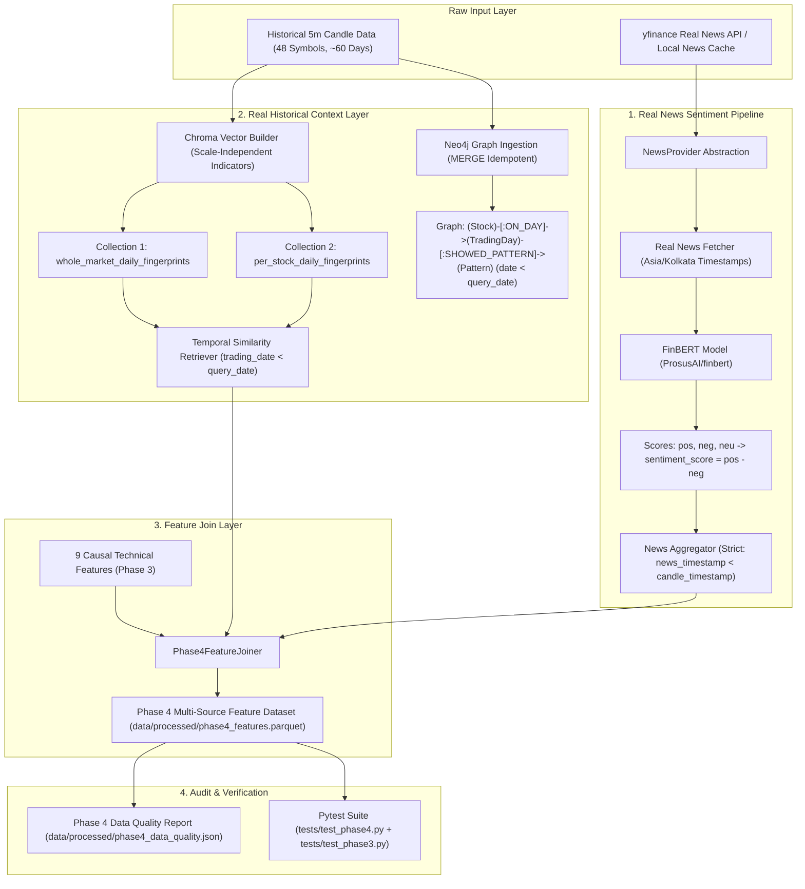

# Phase 4 — Real News Sentiment & Real Historical Context Implementation Plan

This implementation plan outlines the architecture, component design, timestamp policies, and verification steps for Phase 4 of Trade-Assist.

Phase 4 replaces remaining placeholder information sources with **real historical news sentiment (FinBERT)**, **real market and stock historical context (Chroma collections)**, and **real historical graph relationships (Neo4j)**, producing a leakage-free feature layer ready for future ML comparison against the Phase 3 technical baseline.

---

## User Review Required

> [!IMPORTANT]
> **Strict Baseline & Live API Isolation**: Phase 4 does **NOT** train ML models, alter Phase 3 model results (`data/processed/phase3_model_results.json`), modify Phase 2 datasets/labels, or alter live prediction/sentiment API behavior. Phase 4 features and modules remain strictly isolated from production runtime endpoints.

> [!WARNING]
> **Strict Temporal Leakage Prevention**:
> 1. **Completed-Day Rule**: Chroma and Neo4j daily fingerprints are completed-day artifacts. A fingerprint for trading date $D$ may ONLY be retrieved for prediction timestamps strictly AFTER the completion of date $D$ ($\text{trading\_date} < \text{query\_date}$).
> 2. **Prohibition of Current-Day Fingerprints**: Intraday predictions on trading day $D_{\text{current}}$ are **STRICTLY PROHIBITED** from retrieving current-day ($D_{\text{current}}$) daily fingerprints from Chroma or Neo4j.
> 3. **Neo4j Temporal Cutoff**: Historical pattern occurrences and outcome statistics in Neo4j must apply the exact same temporal cutoff ($\text{occurrence\_date} < \text{query\_date}$).
> 4. **News Temporal Rule**: For candle timestamp $T$, only news published strictly before $T$ ($\text{news\_timestamp} < T$) is eligible.

> [!NOTE]
> **Scale-Independent Fingerprint & NaN Missing News Representation**:
> 1. **Scale-Independent Vector**: Raw `close_price` is **REMOVED** from primary stock similarity vectors. Fingerprints use strictly scale-independent features (`price_vs_ema5`, `rsi`, `obv_norm`, `bollinger_position`, `macd`, `macd_signal`, `macd_diff`, `price_vs_vwap`, `direction`).
> 2. **Explicit NaN Missing News**: When `has_news = False`, sentiment numeric fields (`mean_sentiment`, `positive_probability_mean`, `negative_probability_mean`, `neutral_probability_mean`) are explicitly set to `NaN`, and `number_of_articles = 0`. Missing news is **NEVER** silently imputed as zero sentiment. This preserves the distinction between "no news" (`has_news = False`, `sentiment = NaN`) and "neutral news" (`has_news = True`, `mean_sentiment = 0.0`).

---

## Architecture & Data Flow

---

## Component Specifications

### 1. Real News Sentiment Engine (`app/ml/news_processor.py`)
- **NewsProvider Interface**: Abstraction for fetching real news by symbol. Implements `YFinanceNewsProvider` and `LocalNewsCacheProvider`.
- **Timezone Policy**: Timestamps parsed with original timezone and converted consistently to `Asia/Kolkata` (IST).
- **FinBERT Sentiment Analyzer**:
  - Model: `ProsusAI/finbert` (HuggingFace Transformers `pipeline`).
  - Output: `positive_probability`, `negative_probability`, `neutral_probability`.
  - Deterministic score: `sentiment_score = positive_probability - negative_probability`.
  - Cached model loading: Loaded once and reused across batches (`data/processed/finbert_sentiment_cache.json`).
- **Timestamp Aggregation Policy**:
  - For candle timestamp $T$: strictly include news with $\text{news\_timestamp} < T$.
  - Aggregated features: `number_of_articles`, `mean_sentiment`, `positive_probability_mean`, `negative_probability_mean`, `neutral_probability_mean`, `latest_news_timestamp`, `has_news`.
  - **Explicit NaN Representation**: When `has_news = False`, `number_of_articles = 0`, and sentiment numeric fields are set to `NaN`.

### 2. Real Historical Chroma Vector Store (`app/db/vector_store.py` & `app/ml/context_store.py`)
- **Two Collections**:
  1. `whole_market_daily_fingerprints`: Daily cross-sectional market state.
  2. `per_stock_daily_fingerprints`: Daily stock state using 9-dim scale-independent indicator vector.
- **Scale-Independent Vector Specification**:
  $$\vec{v} = [\text{price\_vs\_ema5}, \text{rsi}, \text{obv\_norm}, \text{bollinger\_position}, \text{macd}, \text{macd\_signal}, \text{macd\_diff}, \text{price\_vs\_vwap}, \text{direction}]$$
- **Deterministic Document IDs**:
  - Market: `market_{trading_date}` (e.g. `market_2026-07-01`)
  - Per-Stock: `stock_{symbol}_{trading_date}` (e.g. `stock_RELIANCE.NS_2026-07-01`)
- **Idempotent Upsert**: Uses `upsert()` to prevent duplicate entries.
- **Strict Temporal Query Rule**:
  Query at timestamp $T$ on date $D_{\text{query}}$ filters Chroma using `where={"trading_date": {"$lt": D_query_str}}`. Current-day ($D_{\text{query}}$) fingerprints are strictly inaccessible.

### 3. Real Historical Neo4j Graph (`app/db/graph_store.py` & `app/ml/graph_ingestion.py`)
- **Schema**:
  `(Stock {symbol})-[:ON_DAY]->(TradingDay {date})-[:SHOWED_PATTERN]->(Pattern {name})-[:USES_INDICATOR]->(Indicator {name})`
  `(Pattern)-[:RESULTED_IN]->(Outcome {avg_return, direction})`
  `(TradingDay)-[:PART_OF]->(MarketRegime {name})`
- **Strict Temporal Cutoff**: Cypher retrieval queries enforce `WHERE td.date < $query_date`. Outcome statistics are calculated strictly from pattern occurrences prior to the query date.
- **Idempotence**: Cypher `MERGE` queries avoid duplicate nodes or relationships.

### 4. Feature Join Layer (`app/ml/feature_joiner.py`)
- Combines 9 Phase 3 technical features with News features and Chroma Historical Context features on `(symbol, timestamp)`.
- Enforces strict temporal alignment without forward leakage.
- Generates joined Parquet file `data/processed/phase4_features.parquet`.

### 5. Data Quality Reporting (`app/ml/phase4_data_quality.py`)
- Generates `data/processed/phase4_data_quality.json`.
- Reports overall and per-symbol coverage:
  - `number_of_symbols`
  - `number_of_trading_days`
  - `number_of_candles`
  - `number_of_news_articles` (total articles fetched)
  - `number_of_candles_with_usable_news`
  - `percentage_missing_news`
  - `news_coverage_by_symbol` (dict mapping symbol -> {articles, usable_candles, pct_missing})
  - `finbert_processing_success_rate`
  - `chroma_market_fingerprints_count`
  - `chroma_stock_fingerprints_count`
  - `neo4j_trading_day_nodes_count`
  - `temporal_leakage_checks_passed`

---

## Proposed File Specifications

### [MODIFY] [implementation_plan.md](file:///d:/proj1/proj%20files/implementation_plan.md)
* Revised implementation plan with updated NaN missing news rules and per-symbol coverage reporting.

---

## Verification Plan

### Automated Tests
- Run `python -m pytest` to verify all 72 unit tests pass:
  - News timestamp filtering (10:00 candle cannot see 11:00 headline).
  - FinBERT sentiment calculation (`pos - neg`).
  - Scale-independent vector format test (no raw close_price).
  - Chroma 2-collection schema & strict `trading_date < query_date` temporal query test.
  - Neo4j `MERGE` idempotence & temporal query test (`td.date < query_date`).
  - Feature join dataset alignment & NaN handling test.
  - Phase 3 baseline integrity check.

### Data Quality Audit
- Run `python -m app.ml.phase4_pipeline` and verify generation of:
  - `data/processed/phase4_features.parquet`
  - `data/processed/phase4_data_quality.json`
  - `docs/PHASE_4_REAL_CONTEXT.md`
